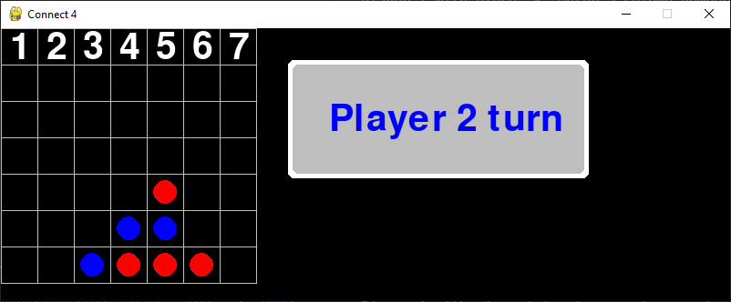
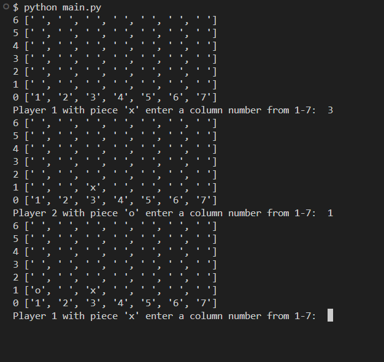

# Connect-4 Game for two players. 

### How to run:

To play the game with PyGame graphics, run: 

`python gamepy.py`

To play on the console,  run:

`python main.py`

---

### Requirements:

- python 3.8 or later.
- pygame 2.1.2 or later.

---

### CLI Installations:

`pip install pygame`
